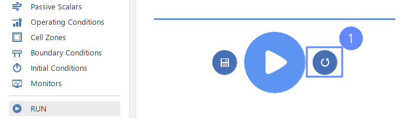
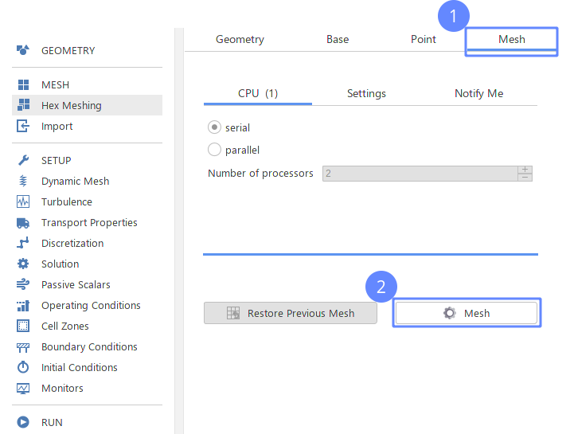
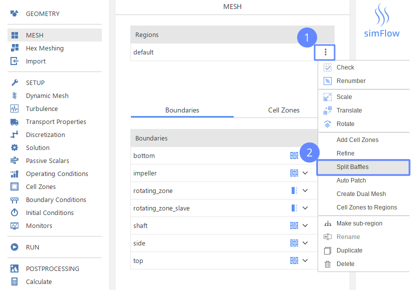
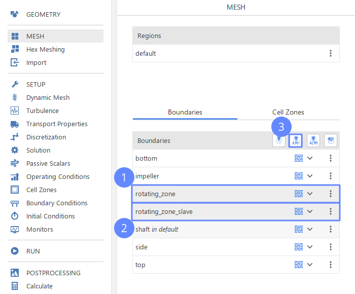
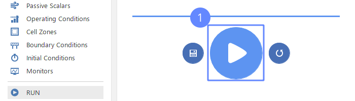

==================
Correcting Impeler
==================
:date: 2019-10-21 00:55
:modified: 2019-10-21 00:55
:tags: example, reynolds
:category: yeah
:slug: client_answer
:authors: Wojciech Gryglas
:summary: Short version for index and feeds

Delete Results
==================

Re-generate the Mesh
=====================

Split Baffles
==================

Create Boundary Interface
=========================

Run Simulation Again
=====================

