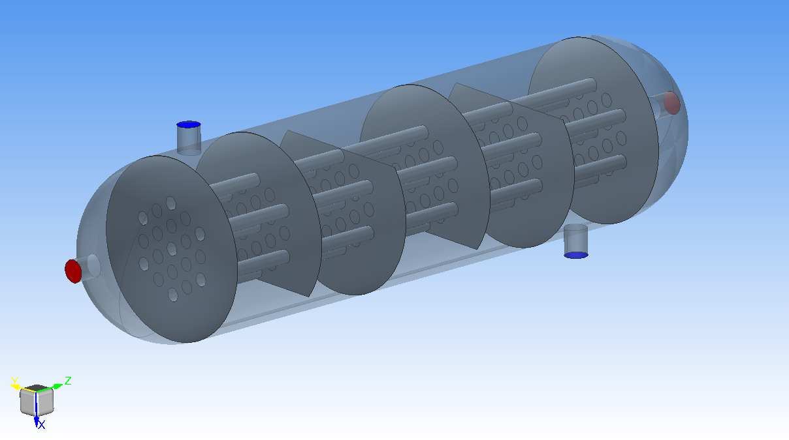
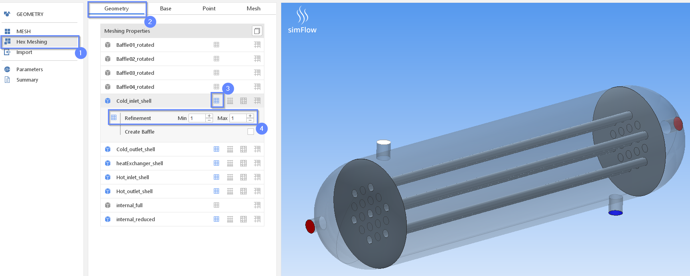
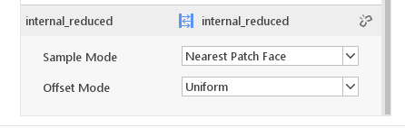
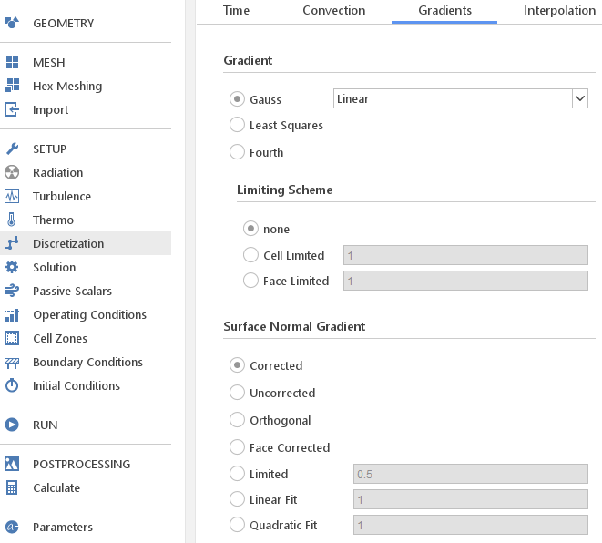

====================================================
CONJUGATE HEAT TRANSFER (CHT) SIMULATION in simFlow
====================================================
:date: 2019-10-08 22:27
:modified: 2019-10-08 22:27
:tags: example, reynolds
:category: yeah
:slug: example
:authors: Pawel Slabosz
:summary: Short version for index and feeds
:version: 4.0

.. image:: ./figures/example/image33.png
   :class: banner

Introduction
====================================================

In this tutorial we will perform a conjugate heat transfer ( CHT )
analysis based on the heat exchanger example. We will demonstrate a
unique approach available in simFlow in which the solid domain is not
meshed, but rather represented by an infinitely thin wall.

Such a strategy of modeling has the following advantages:

  - smaller mesh since we only need to capture the representation of the
    solid (by an infinitely thin wall). This of course will speed up our
    computations
  - possibility to easily and quickly modify internal components of the
    heat exchanger (system of pipes, internal baffles) without the need of
    tedious modeling and meshing process. Therefore, we can speed up the
    product optimization significantly
  - accurate prediction of heat conduction in solid (even though the solid
    is represented by the infinitely thin wall)

But first, let us explain what is the c onjugate h eat t ransfer
simulation?

CHT simulation is the type of the heat transfer analysis in which there
is an interaction between solid and fluid regions. In the solid region
we simulate heat conduction (heat diffusion) due to direct contact. In
fluid region we are dealing with heat convection - transfer of thermal
energy due to movement of fluid elements. And of course at the interface
between solid and fluid regions we have the thermal coupling. So in CHT
analysis we consider transport of mass and thermal energy at the same
time in both solid and fluid region.

simFlow allows considering also other types of heat transfer like
radiation. What is more, in CHT simulation we do not need to consider
only solid to fluid regions. We can have multiple regions (two and more)
also including solid-solid and fluid-fluid interactions.

Objectives of the analysis
====================================================
We would like to analyze and optimize the flow through the heat
exchanger. It is easy to imagine that in the optimization process we
would like to investigate several different geometries (layout of the
pipes, baffles size and location), materials used for pipes, wall
thickness, hot and cold fluid inlet parameters and many others. In
general such a process might be time consuming. In the example given
below we would like to show how thanks to simFlow we can speed up the
process of optimization and get the most out of our simulations.

Approach
====================================================
We will start with the baseline geometry presented in Figure 1. The
geometry of our heat exchanger consists of hot fluid inlet and outlet
section, cold fluid inlet and outlet section with pipes inside and
baffles that guide the flow (increased contact time between hot and cold
fluids). In our approach we will not mesh the solid regions (pipes,
baffles) but we will model those components as infinitely thin walls.
You will see that this approach will reduce number of elements and
allows very fast modification of geometry during the optimization
process - Figure 2 (increased number of inner pipes).

   
   Figure 1

.. figure:: ./figures/example/image33.png
   
   Figure 2

Create case
====================================================
After starting simFlow we need to define a new case in the working
directory (all your files will be stored in <Workspace>/<Case
Name>/<Case Name> ):

  1. Enter the name of your case
  2. Press ``Create Case`` to open the main simFlow window

|image2|

Load geometry
====================================================
In the main window go to Geometry section 1 and then press Load geometry
button 2 . The Select file windows appears which allows you loading CAD
files you need 3. Once all the necessary files are selected press Open
button 4  (you may also load additional CAD files later on).

|image3|

.. note:: The Name After loading the geometry you might recognize
   that the edges representation is not sharp - see the example of 
   the internal parts of our heat exchanger.

.. warning:: Title for the sest test test test ad as

     - ad asd ad
     - ads as das :math:`sin(x)\alpha`
     
   das da da sda sd dsad

|image4|

If this is the case, press the left mouse button on the geometry which
you want to refine :number:`1` and select ``Surface Quality``: Very Fine 2. 
The surface representation will affect the numerical mesh, therefore in case of
mesh quality issues, the geometry must be verified.

|image5|

In this tutorial we need to modify the surface quality representation
for components: internal_reduced and heat_exchanger_shell.

Geometry
====================================================
You can examine the geometry in simFlow, by manipulating the view,
turning on and off particular components that were loaded. Please note
that inlet and outlets are the separate components. It was done by
purpose like this, since in the meshing phase it will make the creation
of the boundary conditions easier.

Also, please note that the geometry was created in units of [mm]. We
need to scale it to [m]. To do it please perform the following steps:

  1. Go to Geometry section
  2. Select all the components on the list
  3. Additional buttons appear :math:`\rightarrow` select Scale Geometries
  4. Select uniform option
  5. Enter :input:`0.001`
  6. Press Scale

|image6|

Meshing
====================================================
Since we are going to perform CHT simulation, we need to create mesh
that represents each fluid and solid region. In the typical heat
exchanger we would have 3 regions: hot fluid region, cold fluid region
and solid region (that represents pipes and buffles). To remind, in this
tutorial we will use the alternative approach, in which we will skip the
solid region and represent it by infinitely thin walls.

Therefore, we will need to mesh only two fluid regions: hot and cold
fluids.

.. note:: High mesh quality is a key factor of successful CFD simulation. 
   The meshing strategy should include:
   
    #. Type of the flow: laminar or turbulent
    #. Physical phenomena that occurs: for example dominant convection or
       diffusion
    #. Boundary layers in case of turbulence modeling
    #. Regions of high importance where high density mesh should be applied
    #. But also time frame and CPU time needed to obtain the results. Very
       often we need a compromise between high quality mesh and reasonable time
       for computations

For the purpose of this tutorial, very simplified mesh will be used. We
will not apply any special refinement, we will skip boundary layers
creation as well.

The goal of this tutorial is to show the possibilities of simFlow in
terms of conjugate heat transfer simulations and demonstrate the
workflow process.

Hot fluid region (I)
====================================================

Selection of the geometry for the meshing
----------------------------------------------------

First, we will create the mesh for the hot fluid region.
  #. Go to the Hex Meshing section
  #. Select Geometry tab
  #. Select the geometry which you want to mesh. Please note that at this
     point, we skipped baffles
  #. We will start with the very basic refinement, so please set Min and
     Max to 1. Later we will examine the mesh and go back if necessary to
     this points

|image7|

Hot fluid region (II)
====================================================

Background mesh definition
----------------------------------------------------

Then, let's switch to Base tab.

  #. Select the box shape for our background mesh
  #. Press autosize - simFlow will determine the shape of the box that
     includes complete geometry of the heat exchanger
  #. Set the proper mesh division in x, y and z direction

.. note:: simFlow uses snappyHexMesh tool for mesh creation. snappyHexMesh
   requires background mesh definition defined by the user in Base tab.
   Whenever there is a need to refine the mesh, snappy simply splits into a
   half the base mesh cells (in two directions, creating from one cell four
   smaller cells). Therefore, it is strongly recommended to choose division
   in such a way, that we get equal cell size in each direction.

   Also, please note that in this example we did not define boundaries. It
   is not necessary, since our CAD geometry already contains separated
   boundaries (inlets and outlets as a separate geometry).

|image8|

Hot fluid region (III)
====================================================

Define the point in the mesh (hot fluid)
----------------------------------------------------

Now we need to define a point which is in the first fluid region - hot
fluid region.

  1. Go to Point tab
  2. Enter the coordinate of the point in the hot fluid region
     
     or 
  3. Press Ctrl key on the keybord and shift the point by dragging arrows.

|image9|

Hot fluid region (IV)
====================================================

Crete Mesh
----------------------------------------------------

Now, it's time to create the mesh of the hot fluid region.

  #. Go to Mesh tab
  #. Select serial or parallel execution of snappyHexMesh - in this
     example we are using 4CPUs to perfrom meshing
  #. Press the Mesh button

|image10|

Hot fluid region (V)
====================================================

Examine the mesh
----------------------------------------------------

When the meshing is completed, simFlow will go to the MESH section 1. 
Also, in the terminal we will get the confirmation that the process is
finished 2.
The created mesh will be moved to the default region 3.
Please note that also the list of boundary conditions is already created 4.

|image11|

Now it is time to check the quality of the mesh by using checkMesh tool:

  #. Press three dots next to the default region
  #. Press Check option

|image12|

The summary of the mesh will be given in terminal:

|image13|

Check mesh tool informs us that the mesh quality is OK.

Additionally, we should make the visual inspection of our mesh. Rotate
the model, apply different cross sections to examine carefully your
mesh. By doing so, we will quickly find out that at the pipe inlets the
mesh is distorted. This mesh is not satisfactory! ( 1 )

|image14|

Hot fluid region (VI)
====================================================

Improve the mesh in hot fluid region
----------------------------------------------------

We will go back to Hex Meshing panel 1  and increase Max level to 2 for
internal_reduced and heatExchanger_shell components 2 . Then go back
to MESH panel and create the mesh once again.

Don't worry about previously created mesh. If it is in Default region,
then it will be replaced by the newly created one.

|image15|

Once the meshing is finished perform Mesh check and visually inspect the
mesh. Now the quality should be acceptable for our needs.

|image16|

Hot fluid region (VII)
====================================================

Create hot fluid sub-region
----------------------------------------------------

Now the last step in meshing of hot fluid region is to create the sub-region:

  #. Go to MESH section
  #. Press three dots next to default region
  #. Select Make sub-region
  #. Enter the name, for example hot_fluid
  #. And press OK

|image17|

The mesh is moved to a separate region. If we forgot about this step
(mesh remains in default region) and move to meshing of the cold fluid,
then we would remove the existing mesh, once the mesh for the new region
is created.

Cold fluid region (I)
====================================================
Now we can mesh the second region of the cold fluid. Basically the
process is identical as in meshing of hot fluid regions described in
sections I to VII. Therefore, here we will limit the description only to
differences.

Selection of the geometry for the meshing

In cold fluid region we also need to include the geometry of internal
walls. Those will be once again models as infinitely thin walls. There
are treated as baffles. Baffles are exactly the same boundaries of the
mesh with faces and nodes located at the same position. By assigning the
wall to those meshes we will be able to simulate the obstacle in the
flow.

The following steps must be taken:

  1. Go to the Hex Meshing sections
  2. Indicate additional geometry to be meshed and select the baffle
     option (please also set fine representation of the baffles geometry as
     described in Load geometry section)
     
|image18|

Cold fluid region (II)
====================================================

Background mesh definition 
----------------------------------------------------

The background mesh remains the same as for hot fluid

Cold fluid region (III)
====================================================

Define the point in the mesh (cold fluid)
----------------------------------------------------

We need to move a point in the cold fluid region

  1. Go to ``Point`` tab
  2. Enter the coordinate of the point in the cold fluid region
    

.. tip:: Press Ctrl key on the keybord and shift the point by dragging 
   arrows.

|image19|

Cold fluid region (IV)
====================================================
Section IV to VII should be done in the same way as for hot fluid region:

  - verify the mesh quality
  - create the cold fluid sub-region

Few comments about the created mesh

Now we have the mesh for hot and cold fluids. The solid was not meshed.
Therefore the question remains, how hot and cold fluid interact with
each other? To answer that question, let's review the list of created
boundaries in simFlow.

First on the list are baffles. Those are the surfaces with identical
nodes and face locations. The mesh here is duplicated. We will define
them as wall boundary condition. Modeling internal walls as infinitely
thin walls allows using coarser mesh. Also, we can quickly modify the
baffle shape or location and load it to simFlow and repeat the meshing
process. This is especially useful when doing product optimization.

Another interesting boundary conditions are internal_reduced boundaries
that appear in hot and cold fluids. These are the interfaces between
both regions. At the moment there are separated, but we will connect
them into the mapped wall boundary condition and by modeling thermal
resistance on it, we will treat them as wall with specified thickness
and conduction properties.

  1. Select first internal_reduced boundary in hot_fluid
  2. With pressed Ctrl button select internal_reduced boundary in cold_fluid
  3. Press Create Region Interface button

|image20|

A s a result, internal_reduced boundaries are connected into one

|image21|

Also, please define inlets and outlets as patch boundary condition 1 and 2 . 
Additionally, please note that heatExchanger_shell occurs twice in hot and 
cold fluid regions. These are walls of the heat exchanger but there should not 
be connected like internal_reduced boundaries. To avoid confusion it is 
suggested to rename it by double clicking on the name like in the example 
below - 3 and 4 .

|image22|

Solver
====================================================

Now we are ready to set-up the solver

1. Go to the Setup sections
2. After creating the fluid regions, CHT solvers are available. Please
   select CHT Multi Region SIMPLE to select conjugate heat transfer, steady
   state solver
3. Press Select to continue model definition

|image23|

Radiation
====================================================
It is possible to include another type of heat transfer - radiation.
However, in this tutorial we will skip it.

  1. Turn off the radiation
     
     |image24|

Turbulence
====================================================

We will model the flow as laminar

|image25|

Thermophysical properties
====================================================

Now we need to define the fluid properties. We will assume that working
fluid for hot and cold region is water.

|image26|

Discretization
====================================================
In the discretization panel choose the following:

Time: steady state
|image27|
 
Convection: Upwind
|image28|

Gradients: Gauss Linear and Corrected Surface Normal Gradient
|image29|

Interpolation: Linear
|image30|

Solution
====================================================
Solver Tab
----------------------------------------------------

For :math:`p-{\rho} g h`, U and h choose Smooth Solver with the settings as below:

|image31|

For :math:`\rho` and h (solid) choose GAMG solver with settings as below:

|image32|

For tabs SIMPLE, Residuals, Relaxation and Limits use the default
settings.

Operating conditions
====================================================
We will neglect the influence of the gravity

|image33|

Boundary conditions (I)
====================================================
Baffles
----------------------------------------------------

In our case the baffles (the master and slave side) have conformal
meshes - there are treated as a coupled wall. For equations other than
momentum, each side of such baffles can be treated individually or
jointly. We will enter the nonzero wall thickness introducing a thermal
resistance on each side of the baffle.

.. note:: 
   Hint!
   If the baffles are non-conformal, we must create an interface similar to
   that of internal_reduced.

For baffles we will use heat flux thermal boundary conditions.
No heat is generated so q must be set to 0. But the Resistance option must be activated 
to define the wall thickness :math:`\delta` in [m] and thermal conductivity
:math:`\kappa[W/mK]`, for copper :math:`\kappa=400[W/mK]`.

|image34|

Boundary conditions (II)
====================================================
Walls - heatExchangerWall_cold and heatExchangerWall_hot
---------------------------------------------------------

We will assume that walls of the heat exchanger are adiabatic

|image35|

Boundary conditions (III)
====================================================
Interface between fluids internal_reduce
----------------------------------------------------

Here we are using the mapped_wall boundary condition. The meshes in hot
and cold regions are not identical. But the walls will be coupled.

|image36|

Boundary conditions (IV)
====================================================
Inlet and outlets
----------------------------------------------------

For inlets we will use velocity inlet boundary condition. Hot fluid
inlet temperature will be :input:`383d` K, for cold fluid :input:`283d` K.

For the outlet, pressure outlet boundary condition will be used.

Hot inlet
====================================================
|image37|

Hot outlet and cold outlet
====================================================
|image38|

Cold inlet
====================================================
|image39|

Initial conditions
====================================================
Initial conditions must be set for each fluid region. Initial velocity
and temperature should be set as for hot inlet for hot fluid region and
cold inlet for cold fluid region

|image40|

RUN
====================================================
  1. Define :input:`5000d` iterations
  2. Define number of CPUs
  3. Press Run button

|image41|

Post-processing in ParaView
====================================================

   
.. |image1| image:: ./figures/example/image33.png
   

   

   

   

   

   

   

   

   

   

   

   

   

   

   

   

   

   
.. |image19| image:: ./figures/example/image23.png
   

   

   

   

   

   

   

   

   

   

   

   

   

   

   

   

   

   

   

   

   

   

