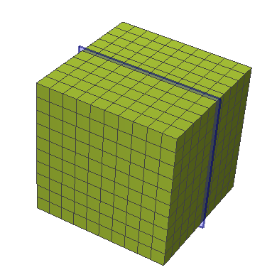

---------------------------------------------------------
Tutorial in SimFlow
---------------------------------------------------------
:date: 2019-10-08 22:27
:modified: 2019-10-08 22:27
:tags: multiphase, vof, interfoam
:category: multiphase
:slug: sample-tutorial
:authors: Wojciech Gryglas
:summary: Short version for index and feeds
:version: 4.0
:type: draft

Intorduction
============

Some text, lets generate placeholder :lorem:`100`

You will learn:

 * :lorem:`20`
 * :lorem:`20`
 * :lorem:`20`
 * :lorem:`20`

.. warning:: This tutorial requires using full SimFlow version, due to the 
   mesh limitation.

Adding Geometry
===============

First go to ``Initial Conditions`` panel, and:

 #. Write :math:`p-\rho g h` value to :input:`10`
 #. Set velocity to :vector:`20 30 40`
 #. Choose the output
 #. :lorem:`10`

.. note:: The :math:`\alpha_{phase1}` is a veriable used for indicating 
   location of the phase. In this case, value **1** would indicate water
   location while **0** would denote air phase. 

.. image:: ./figures/example2/screenshot_0.png

Adding monitor
==============

Now we will add a monitor to preview results at section plane. 

 #. Go to ``Monitors Panel``
 #. Select ``Sampling`` tab
 #. Click ``Add Slice`` button to create new slice

.. image:: ./figures/example2/screenshot_1.png

The Mesh
=========

