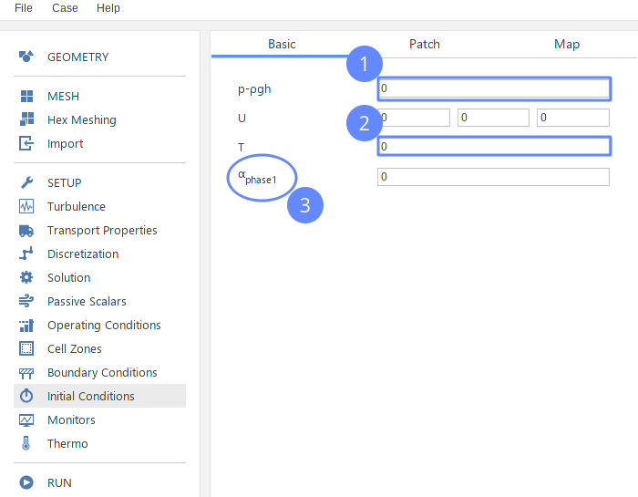
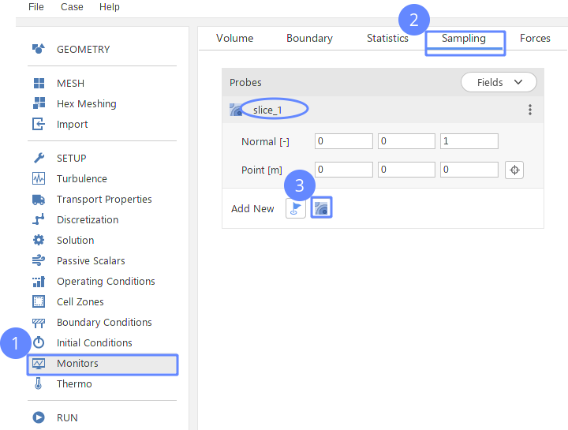

---------------------------------------------------------
Tutorial in SimFlow
---------------------------------------------------------
:date: 2019-10-08 22:27
:modified: 2019-10-08 22:27
:tags: example, reynolds
:category: yeah
:slug: sample-tutorial
:authors: Wojciech Gryglas
:summary: Short version for index and feeds
:version: 4.0

Introduction
-------------

Hello wrold. This will be a sample tutorial written under
reDocEditor and using the Pelican static website build. 

Run simulation
--------------

First:

 #. Set maximum number of iterations
 #. Click ``Run`` button.
 

Compute Turbulence Fields
-------------------------

 #. Go to ``Calculate`` panel
 #. Select ``Full Time Range``
 #. Select ``Turbulence Fields``
 #. Click ``Calculate`` button

