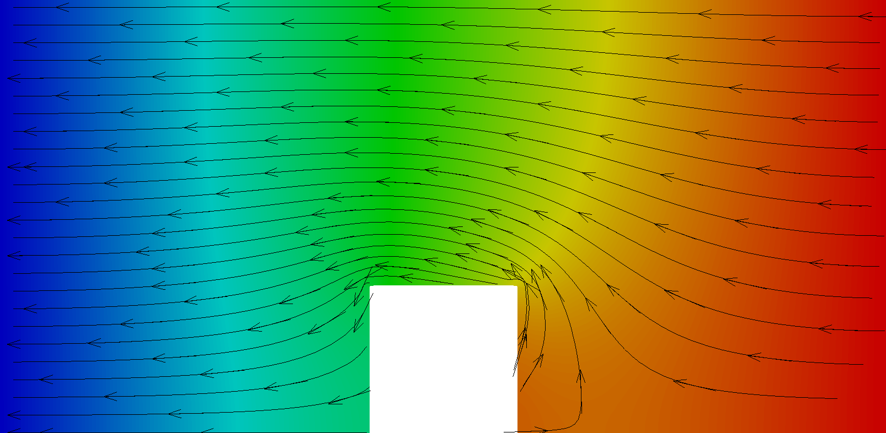
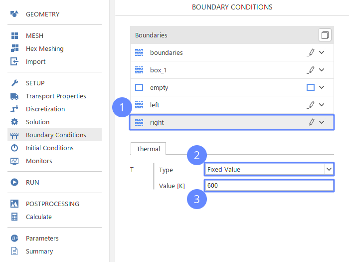

-------------------
Heat Conduction
-------------------
:date: 2019-11-19 21:48
:modified: 2019-11-19 21:48
:tags: example, reynolds
:category: yeah
:slug: heat-conduction
:authors: Wojciech Gryglas
:summary: Short version for index and feeds

Introduction
-------------

In the following tutorial you will learn how to:

* Create heat conduction through the copper plate
* Use parameters and apply it to inputs
* Apply heat flux at a wall
* Compute heat flux and display heat flow paths

Create Case
------------

When SimFlow launcher is opened:

#. Type the case name ``heat_conduction``
#. Click ``Create Case`` button to confirm

Add Box
-------

Create box geometry:

#. Click ``Add box`` button
#. Specify box geometry

``Origin [m]`` :vector:`-0.25 -0.5 -0.5`

``Dimensions [m]`` :vector:`0.5 1 1`

Select Mesh Geometry
--------------------

#. Go to ``Hex Meshing``
#. Select `box_1` geometry to be used as a cell removal selector.

Define Initial Mesh
--------------------

#. Change tab to ``Base``
#. Change ``Base Mesh Type`` to ``Plate``
#. Specify ``Plate`` geometry

``Min [m]`` [:input:`-1.5` :input:`-1.5`]

``Max [m]`` [:input:`1.5` :input:`1.5`]

#. Specify mesh spacing

``Division`` [:input:`100` :input:`100`]

#. Change `boundaries` type to ``wall``
#. Change ``Plate`` side names:

``X-`` side to `left`

``X+`` side to `right`

Define Material Point
---------------------

Specify which part of ``Base`` mesh should remain after performing
cell removal using the `box_1` geometry.

#. Change tab to ``Point``
#. Set ``Material Point`` location to :vector:`0 0.7 0.015`

.. note:: You can set point location by using arrows manipulator in 3D
    graphics. Hold `CTRL` button and drag one of the arrows.

Create Mesh
---------------------

#. Go to ``Mesh`` tab
#. Click the ``Mesh`` button to run meshing.

.. image:: ./figures/heat-conduction/ht-6-create-mesh.png

View Mesh
---------------------

When the mesh is ready you should see the following result. This is 2D mesh with one
cell in `z` direction. In SimFlow all meshes are defined as 3D. The 2D flow is
enforced by the ``empty`` boundary type assigned to the front and back sides.

In our example the mesh consists of 5 boundaries:

#. boundaries (top and bottom sides)
#. left
#. right
#. box_1 (derived from box geometry)
#. empty (front and back sides, green in the picture below)

.. :width: 400 px

Select Solver
---------------------
Now we need to choose what type of problem we are going to solve.
By selecting the solver we choose the appropriate numerical algorithm
suitable to solve specific phenomena.

For this tutorial, we will choose the ``Laplacian`` solver.
This solver implements a Finite Volume Method to solve the `Laplace Equation`:

.. math::
    \Delta T = 0

In SimFlow:

#. Go to ``SETUP`` panel
#. Enable `Incompressible` ``Flow`` filter
#. Select `Heat Transfer` ``Model`` filter
#. Select `Laplacian` solver from the list
#. Click on ``Select`` button.

Create Parameters ( I )
-----------------------------

#. Go to ``Parameters`` panel
#. Insert new paremter:

Set ``name`` to `kappa`

Set ``Formula`` to :input:`401`

#. Click ``Add`` button to create `kappa` parameter

Create Parameters ( II )
----------------------------------------

While we are still in the ``Parameters`` panel we will add next parameters in
the same way as before:

#. `Cp` = :input:`390`
#. `rho` = :input:`8960`
#. `Dt` = ``kappa / (rho * Cp )``

Set Diffusivity Coefficient
----------------------------------------

Use `Dt` parameter to provide the diffusivity coefficient:

#. Go to ``Transport Properties`` panel
#. Type ``Dt`` in the input field

Box Boundary Heat Flux
----------------------------------------

For the `box_1` boundary we will assign heat flux equal
:math:`0.1[\frac{W}{s m^2}]`. The collection of available boundary
conditions doesn't contain exactly the heat flux condition. However, it
is possible the achieve the same effect by using the ``Fixed Gradient``
condition. To do this we will use the
`Fourier Law`:

.. math::
    q = -\kappa \cdot \nabla T \rightarrow \nabla T = -\frac{q}{\kappa}

To apply heat flux at `box_1` wall:
#. Go to ``Boundary Conditions`` panel
#. Select `box_1` boundary
#. Change ``Type`` to ``Fixed Gradient``
#. Insert formula ``0.1*kappa``

Left Boundary Temperature
----------------------------------------

For the left and right boundaries we will apply constant temperatures:

#. Select `left` boundary
#. Change ``Type`` to ``Fixed Value``
#. Make sure that temperature value is equal to :input:`300`

Right Boundary Temperature
----------------------------------------

At the right boundary we will apply higher temperature:

#. Select `right` boundary
#. Change ``Type`` to ``Fixed Value``
#. Set temperature value to :input:`600`

Create Slice Monitor
----------------------------------------

Before start computation, we will add a slice for monitoring
results during the calculation.

#. Go to ``Monitors Panel``
#. Select ``Sampling`` tab
#. Expand ``Fields`` and check the ``T``
#. Click on ``Slice`` button to add a new slice
#. Specify slice ``Point [m]`` to :vector:`0 0 0.05`

Run Simulation
----------------------------------------

Finally, we can start the simulation. The `Laplace Equation` is a linear partial
differential equation and can be solved just in 1 iteration. We
should expect that the solver will converge just after making one iteration.
We do not have to change maximum ``Number of Iterations`` because solver will
stop when the convergence criterion is fulfilled.

#. Go to ``Run`` panel
#. Click on ``Run Simulation`` button

View Results
----------------------------------------

In the `Create Slice Monitor`_ slide we have to add slice for sampling results
during the calculation. We can preview the results in the ``Slices`` tab.

#. Go to ``Slices`` tab in the 3D graphics window
#. Click on ``Adjust range to data`` button

Postprocess with ParaView
----------------------------------------
Using the slice tool we have initially viewed results. However, a more
comprehensive postprocessing task can be done using the ParaView application.

Using the ParaView we will compute the heat flux vector field and draw heat flow
paths.

#. Change panel to ``Postprocessing``
#. Click on ``ParaView`` button

Load Data
----------------------------------------

After opening ParaView:

#. Click ``Apply`` button to load data

Create Gradient Filter ( I )
----------------------------------------

Press ``CTRL + Space`` on your keyboard to open filter selector and:

#. Start typing `gradient` to shorten the list of available filters
#. Click on ``Gradient Of Unstructured DataSet`` button to add data filter

Create Gradient Filter ( II )
----------------------------------------

#. Type ``Result Array Name`` to ``gardT``
#. Click apply to finish

.. image:: ./figures/heat-conduction/ht-21-create-gradient-2.png

Calculate Heat Flux
----------------------------------------

Now the temperature gradient vector field is available.
We need to recompute gradient to obtain heat flux:

#. Click on ``Calculator`` button
#. Set ``Result Array Name`` to ``HeatFlux``
#. Type heat flux formula ``-401 * gradT``
   (:input:`401` value denotes copper conductivity)

.. image:: ./figures/heat-conduction/ht-22-calculate-heat-flux.png

Heat Flux Streamlines
----------------------------------------

#. Add ``StreamTracer`` filter
#. Specify streamline source line ``Point1`` to :vector:`-1.4 -1.5 0.05`
#. Set ``Point2`` to :vector:`-1.4 1.5 0.05`
#. Set source line ``Resolution`` to :input:`50`
#. Click ``Apply`` to finish

Add Arrows to Streamlines
----------------------------------------

By default, streamlines do not provide flow direction information. To solve
this we can add arrows that are tangent to streamlines.

#. Click ``Glyph`` button to add a new filter
#. Change ``Glyph Type`` to ``2D Glyph``
#. Change ``Vectors`` to ``HeatFlux`` field
#. Set ``Scale Factor`` to :input:`0.15`
#. Change ``Glyph Mode`` to ``Every Nth Point``
#. Put arrows every 10th point by setting ``Stride`` value to :input:`10`
#. Click ``Apply`` button to confirm and display arrows

Create Dataset Group ( I )
----------------------------------------
We want to control the properties of streamlines and arrows as a single entity.
To do this you can group data:

#. Hold ``CTRL`` key and select both `StreamTrace1` and `Glyph1`
#. Click on ``Group Datasets`` button
#. Confirm by clicking ``Apply`` button

Apply Solid Color for Dataset Group
----------------------------------------

#. Select the last filter in the ``Pipeline Browser``
#. Choose data coloring to ``Solid Color``
#. Click ``Edit Color Map`` to open the color selection window
#. Choose black color
#. Apply color by clicking on ``OK`` button

Create Slice
----------------------------------------

In the end, we would like to display a temperature scalar below the streamlines.
The original input data is 3D and is one cell wide. The streamlines and arrows
are attached to cell centers, therefore it will be enclosed by the mesh domain.
To view both streamlines and temperature we need to create a section in the
center of the domain:

#. Select `Calculator1` in the ``Pipeline Browser``
(it will be the data source for the slice)
#. Add slice filter
#. Specify slice plane orientation by clicking on ``Z Normal`` button
#. Confirm by pressing ``Apply`` button

Display Temperature
----------------------------------------

Make sure that the temperature is displayed on the slice.

View Heat Flow and Temperature
----------------------------------------

As a result, you should see the following image in the 3D graphics panel.
This concludes the tutorial.

.. image:: ./figures/heat-conduction/ht-28-view-slice-and-heat-lines.png
