-------------------
This is Main Title
-------------------
:date: 2019-10-24 02:08
:modified: 2019-10-24 02:08
:tags: example, reynolds
:category: yeah
:slug: heat_exchanger
:authors: Wojciech Gryglas
:summary: Short version for index and feeds

Create Case
===========

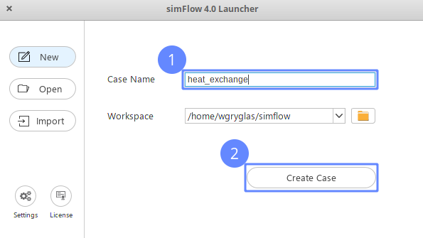

Load Geometries
===============

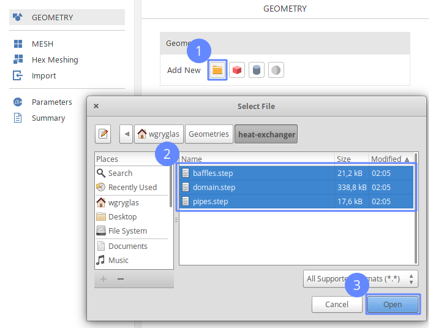

Make Compound Bodies
====================

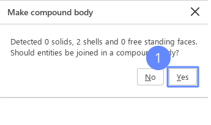

Refine Geometry Representation
==============================

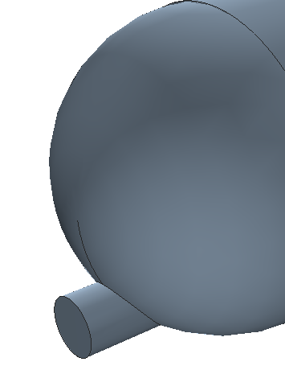

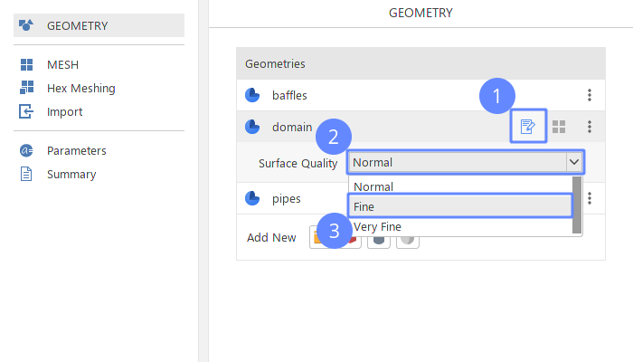

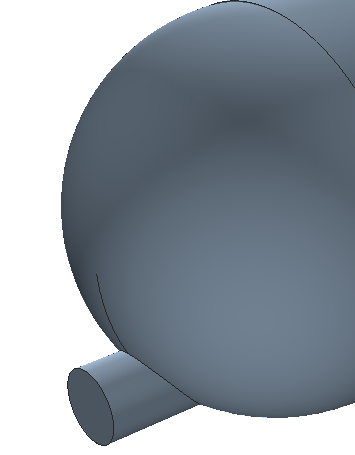

Repeat steps for ``buffles`` and ``pipes`` geometry objects.

Scale Geometries I
==================

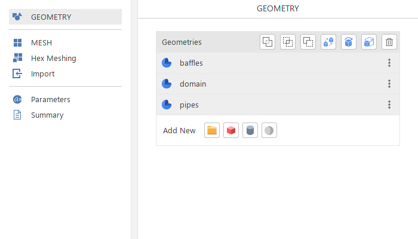

Scale Geometries II
===================

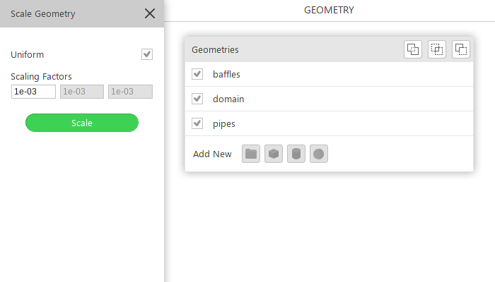

Hot Inlet Selection
====================

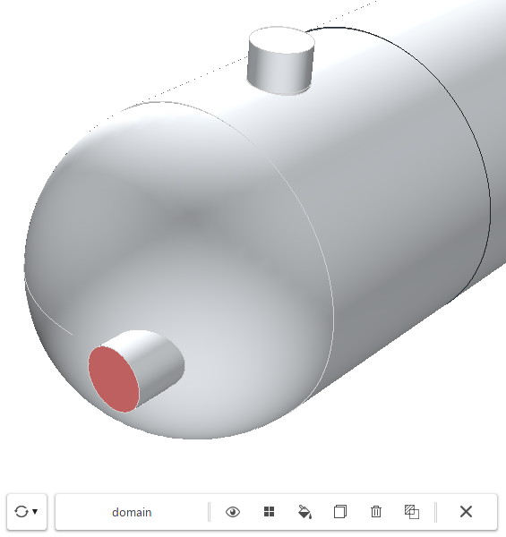

Hot Inlet Name
==============

.. .. image:: ./figures/heat_exchanger/screenshot_9.png

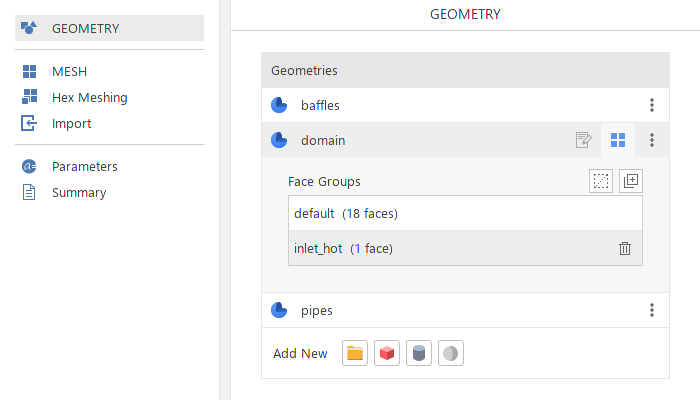

Hot Outlet Selection
====================

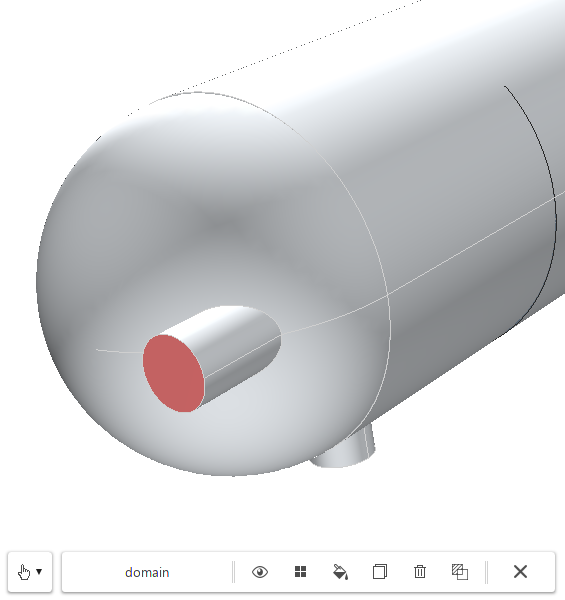

Hot Outlet Name
================

Double click on ``group_1`` name in the ``Face Groups`` list

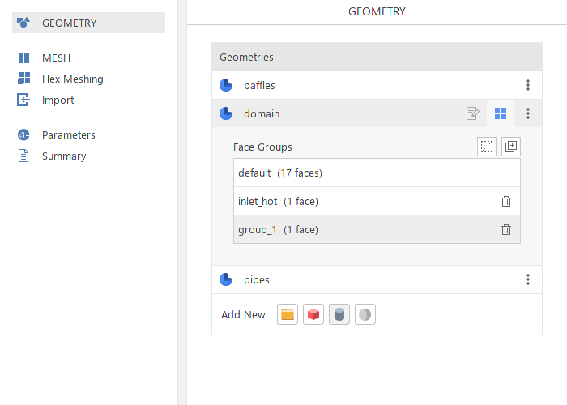

Provide ``outlet_hot`` name.

Click ``Clear Selection`` button

