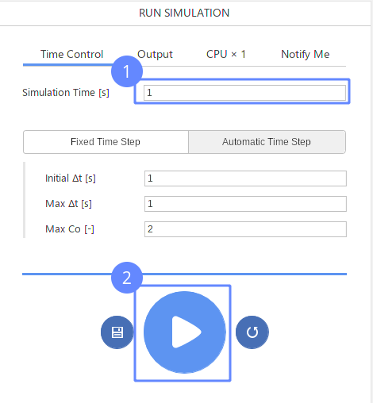
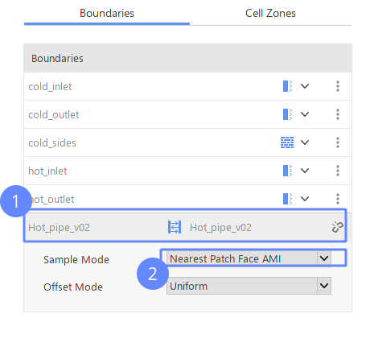

-------------------
This is Main Title
-------------------
:date: 2010-10-03 10:20
:modified: 2010-10-04 18:40
:tags: example, reynolds
:category: yeah
:slug: my-super-post
:authors: Wojciech Gryglas
:summary: Short version for index and feeds

And now goes subtitle
---------------------

now add some text adsa
dasd dasd dasd asd da 

`Hello Dear`_

Write something new to se if live preview works.
Add text in new line but rendered in the same paragrph.

Next paragraph with equation :math:`y = sin(\pi \cdot x)`
and centered equation:

.. math::

	y = \int_a^b x^2 \cdot \beta

Rest of the text :lorem:`100`

This is inline vector input :vector:`10 20 30`

This is second vector float input :vector:`10.0 25.0 13.33`
How old are you. Como estas. 

Next line(paragraph)

.. image:: ./figures/test/Selection_002.png
   :width: 50 %

The list can't exist without the front text?
  * Test
  * Test
  * Test

Hello Dear
----------
Next Long paragraph with 100 words

:lorem:`100`

dasdd  das d dsa ds dsa da

Subtitle
--------

Now, let us see some enumeration:

The list name:
  - a text
  - a second element

Enumeration with auto numbering:
  #. First element
  #. Second element
  #. Third,
  #. etc...

Next Subtitle
-------------

Tsad asd as das. This is reference to `And now goes subtitle`_

Some new text to see how it renders. Seems to be quite all right. 

.. image:: ./figures/test/plecak.png
   :width: 800 px
   
