-------------------
Pipe Tee
-------------------
:date: 2019-10-13 20:06
:modified: 2019-10-13 20:06
:tags: meshing, snappyHexMesh, pipe-tee,
:category: meshing
:slug: simple-meshing
:authors: Wojtciech Gryglas
:summary: Create Mesh in Few Clicks

Start Case
==========

 1. Enter the ``Case Name``
 2. Hit ``Create Case`` button to launch SimFlow

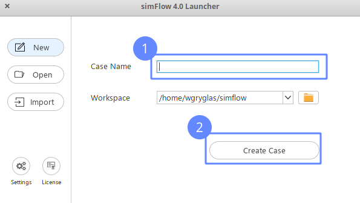

Import Geometry
===============
After launching software go directly to 

  #. ``Geometry Panel``
  #. Click Load Geometry button
  #. Select appropriate ``pipe-tee.stl`` file
  #. Click ``Open`` button to load geometry

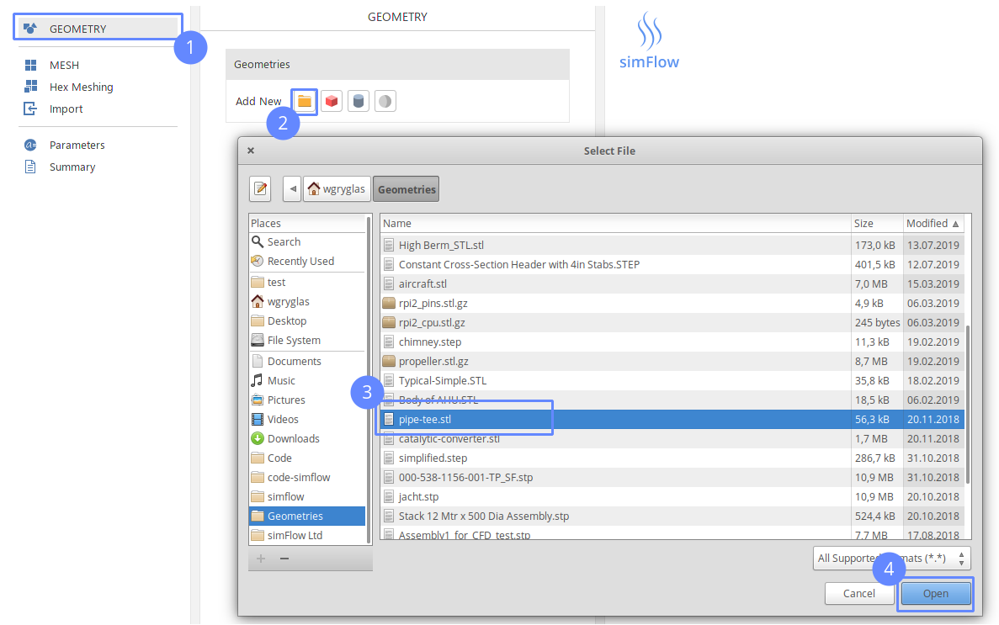

Split Geometry
==============

If the geometry file is of STL type usually we would expect
to have geometry as an only single surface.

.. note:: STL format is a surface mesh format. The geometry is defained
   as a huge collection of small triangular elements which define a surface. 
   This format is usually used in graphics geometry models and recently is 
   well known in the 3D printing world.

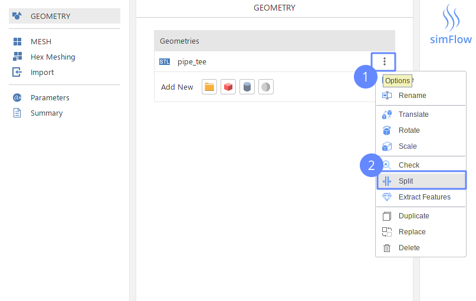

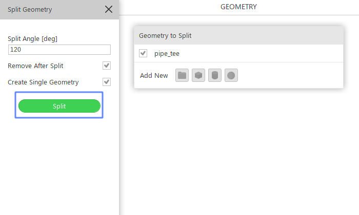

Inlet 1 Face
============
Selection
-------------
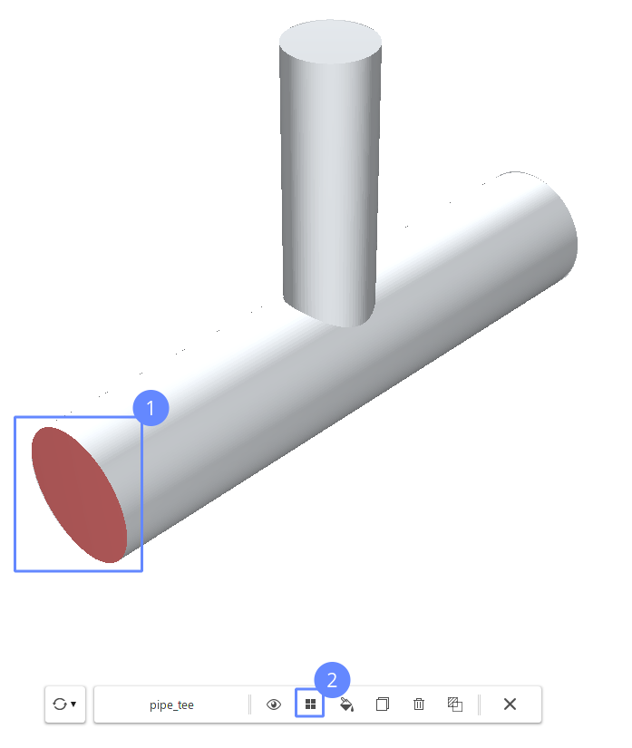

Rename
-------------
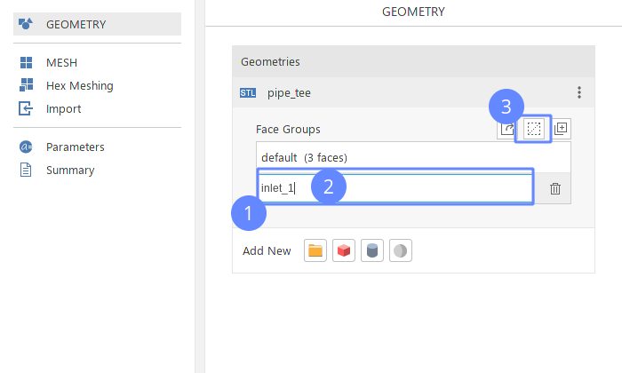

Outlet Face
===========
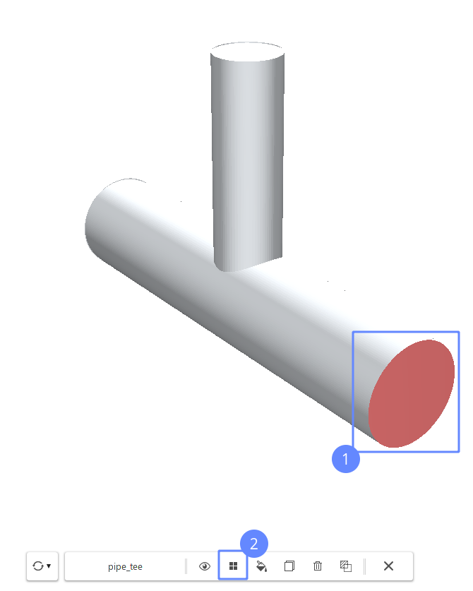

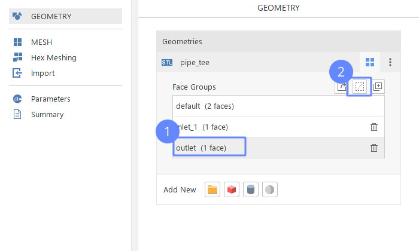

Inlet 2 Face
============
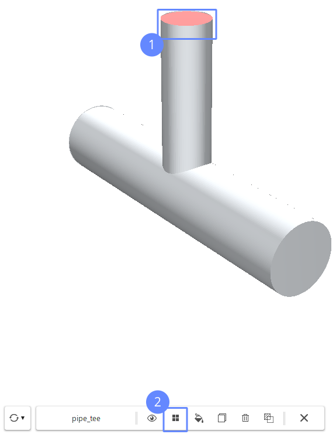

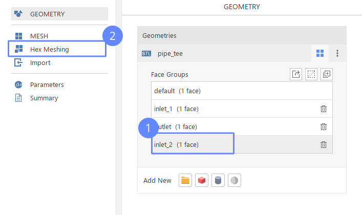

Meshing Geometry
================

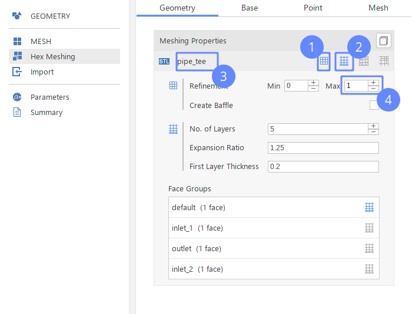

Base Mesh
=========
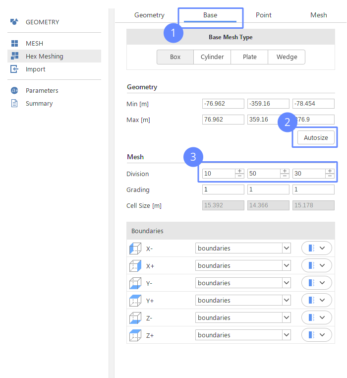

Create Mesh
===========
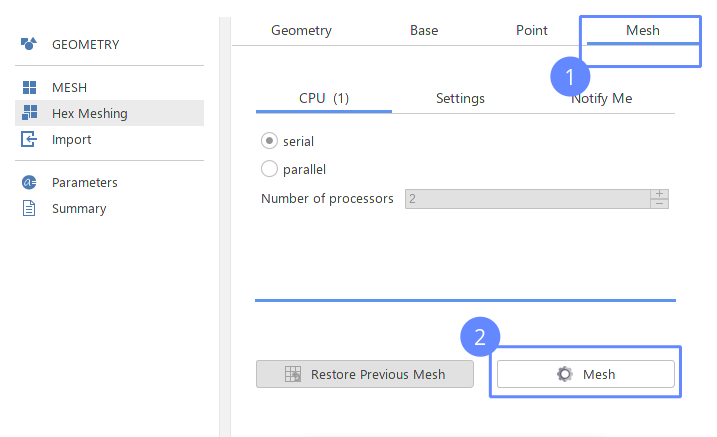

View Mesh
=========
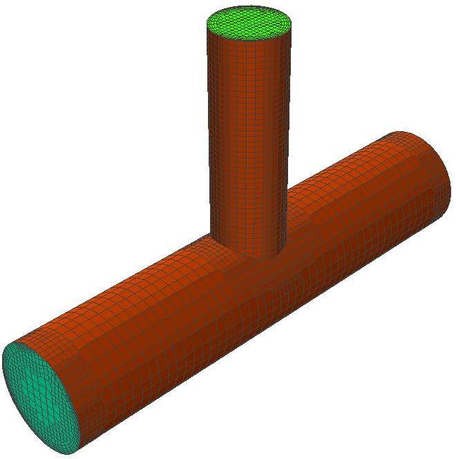

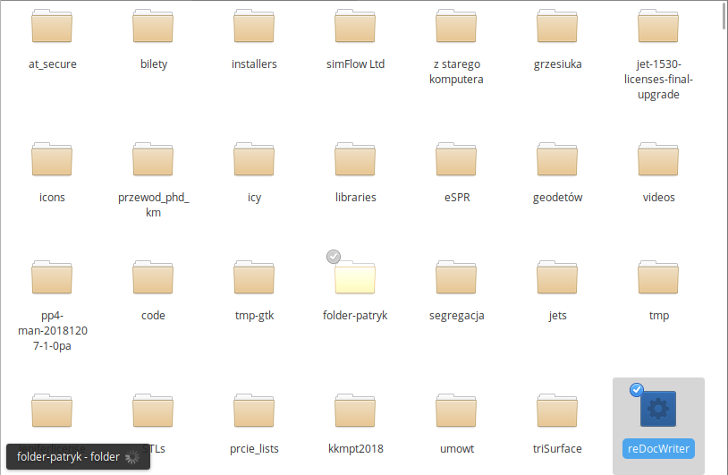

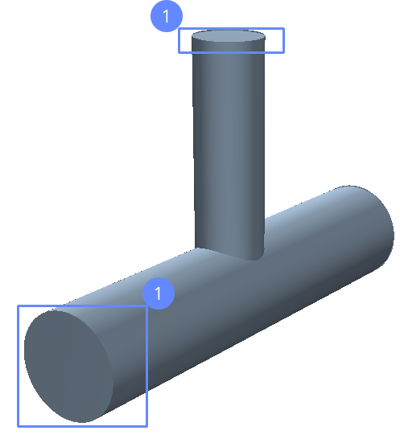
